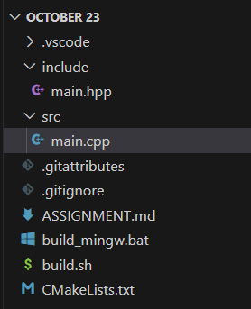

# Двадцать третье октября

## Задание 1

> Создайте проект "Console Application"



## Задание 2

> Создайте несколько переменных. Все переменные должны иметь разный тип данных. Заполните их данными.

(из `src\main.cpp`)

```cpp
unsigned char char_variable = 255;
unsigned short short_int_variable = 65535;
unsigned int int_variable = 4294967295;

char char_array_variable[] = "this is a null terminated string\0";
std::string string_variable = "this is a string from the standard library"; 
```

## Задание 3 

> Перезапишите часть переменных с помощью «cin». Выведите содержимое всех переменных в консоль.

(из `src\main.cpp`)

```cpp
write();
write("this is the value of \"char_variable\":");
write((int)char_variable); 
// a conversion is necessary, otherwise the variable would be written out as a character 

write();
write("this is the value of \"short_int_variable\":");
write(short_int_variable);

// ...

write();
write("enter the new numerical value of \"int_variable\" (from 0 to 4294967295)");
read(int_variable);

write();
write("the new value of \"int_variable\":");
write(int_variable);

// ...
```

`write()` и `read()` определены соответствующе: 

(из `main.cpp`)
```cpp
template<typename T>
void write(T value) {
	
	std::cout << value << std::endl;
}

void write() {

	std::cout << "" << std::endl;
}

template<typename T>
void read(T& variable) {

	std::cin >> variable;
}
```